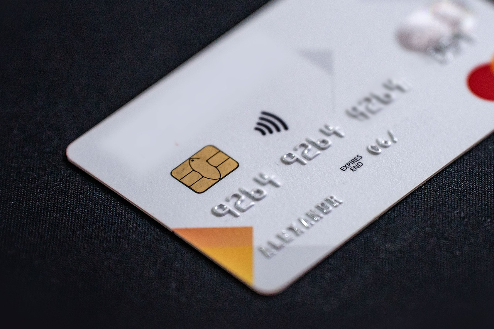
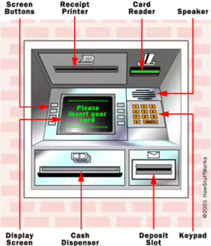
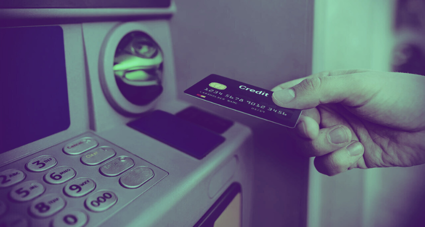
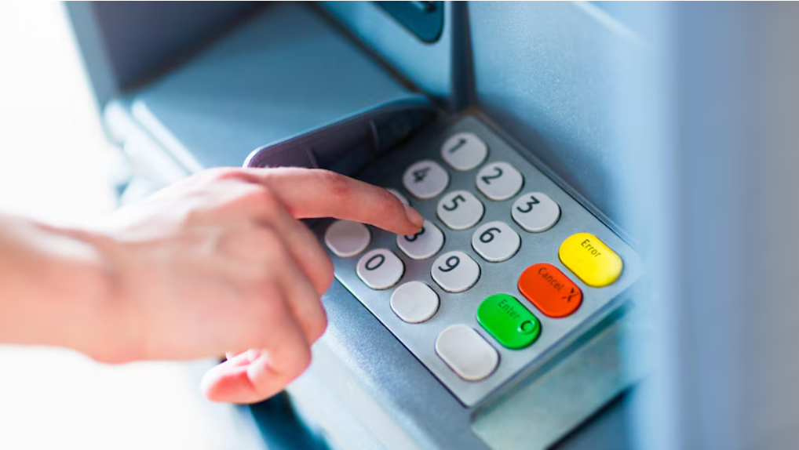

============
 About ATMs
============

Anytime you need cash or want to check the balance on your bank account, you can visit a nearby ATM.

ATM stands for Automated Teller Machine. It allows people to manage their bank accounts and money without the assistance of a bank teller. Some ATMs come with even more functionalities, such as transferring money or paying bills. 

ATMs are easy to navigate. All you need is your plastic (debit or credit) card.

By following these simple instructions, you’ll get the hang of it in no time!

  Plastic card

------------------
 Parts of the ATM
------------------

First, let’s go through the most important parts of an ATM:

If you’re already familiar with an ATM’s navigation, you can skip to the ‘Accessing your account’ or ‘Transactions’ sections.

  Parts of the ATM

1. **Display screen** This screen shows you the options you can choose from.
Options include

- language preferences,
- banking options,
- banknote types,
- request for a paper receipt, etc.

\
2. **Screen buttons** The buttons on the sides of the screen allow you to navigate between the options. Always press the button nearest to an option to select it.

3. **Card reader** This is where you insert your card. The ATM takes it in, reads it, and identifies your bank account.

.. note::
 *When do I get my card back?*

 No worries, you’re card’s not stuck. It’ll be returned at the end, or if you cancel the transaction.

.. warning::
 *Help, my card is stuck!*

 If you have trouble getting your card back once you’re finished, you can use the intercom device or call the customer care number on the ATM.

\
4. **Keypad** The keypad allows you to enter your PIN (personal identification number).
It’s usually a 4-digit number you’re asked to provide after inserting the card. The ATM needs it to verify that you’re the rightful owner of the card.

\
5. **Speaker** The speaker may share information with you or give you instructions to guide you through the process.

\
6. **Cash dispenser** This slot pushes out the money you’ve withdrawn from your account.

.. note::
 Sensors make sure that you receive the right amount of cash. The cash is stored in a secure safe, insured against theft by inc protection.

\
7. **Deposit slot** If an ATM accepts deposits, you can add money to your bank account. You can insert your cash into the machine here. 

\
8. **Receipt printer** If you requested a paper receipt, it will be printed from this slot.

------------------------
 Accessing your account
------------------------
Before we get into the nitty-gritty of ATM transactions, let’s take a look at how to access your account at an ATM.

.. note::
 You need to go through these steps to start a transaction.

\
1. Insert your plastic card into the card reader slot.

.. note::
 There’s a pictogram near the slot that shows how to insert the card. Usually, the chip on the card goes upwards, and the magnetic stripe on the back faces downwards.

\

  Inserting your card

The ATM reads your card and asks for verification.

\
2. Enter your PIN using the keypad.

- Press the green button that says ‘Enter’ or ‘OK’ to continue.
- If you’ve made a typo, you can press the yellow button ‘Clear’ or ‘Error’, then enter the PIN correctly.
- If you want to end the process, press the red button, ‘Cancel’. The ATM will return your card.

.. warning::
 Make sure nobody else sees your PIN.

\

  Entering your PIN

\

After successful verification, you’re usually asked to choose a language. 

\
3. Select your preferred language.

.. note::

 Press the button on the side of the screen that’s closest to the option you want to select. The transaction will continue in this language.

\
Next, you will be presented with banking options.

--------------
 Transactions
--------------

.. note::

 Please check the ‘Accessing your account’ section to learn how to log in to an ATM.

Withdrawing money
=================

This section is going to walk you through the steps of withdrawing money from an ATM.

\
1. Access your bank account.

Please check the ‘Accessing your account’ section to learn how to log in to an ATM.

\
2. Select ‘Withdrawal’ from the list of available banking options.

.. note::
 Press the button on the side of the screen that’s closest to this option.

You will be directed to a new screen showing different withdrawal amounts.

3. You can either select a preset amount or enter a custom one.

a. **Preset** If you select a preset amount, you can continue to step 6.

b. **Custom** If you select ‘Enter a different amount’, you will be taken to a new field. 

With the help of the keypad, put in the exact amount you want to withdraw. Then, press the green button ‘Enter’ or ‘OK’ to confirm.
The ATM warns you if it’s unable to dispense the requested amount. This error is usually caused by an incorrect entry or a lack of the needed denominations. You will have to enter a new amount to resolve the issue.

\
4. Finally, the ATM will ask whether you would like a printed receipt or not.

Select ‘Yes’ or ‘No’ accordingly.

The receipt contains

- the type of transaction,
- the amount you’ve withdrawn, and
- your new account balance.

The card reader will return your plastic card. The deposit slot will count the money and dispense the exact amount of cash in mixed banknotes. 

.. warning::
 You should always make sure you’ve received the right amount before leaving the ATM. 

Checking your balance
=====================

This section explains how to check your account balance.

1. Access your bank account.

.. note::

 Please check the ‘Accessing your account’ section to learn how to log in to an ATM.

\
2. Select ‘Balance’ from the list of available banking options.

.. note::
 Press the button on the side of the screen that’s closest to this option. 

The ATM may ask you to confirm you want a printed receipt.

\
3. Press the green button ‘Enter’ or ‘OK’ on the keypad to continue.

\
4. Take the receipt from the receipt printer slot.

The receipt contains

your current balance,
your bank’s information,
time and date, etc.

Depositing cash
===============

This section will show you how to make a deposit at your bank’s ATM. 

.. note::
 ATMs only accept banknotes in good condition, free of significant rips or creases. Not all ATMs have this functionality, but if it’s available and your bank allows you to, you can deposit cash into your bank account.

\
1. Access your bank account.

.. note::
 Please check the ‘Accessing your account’ section to learn how to log in to an ATM.

\
2. Select ‘Deposit’ from the list of available banking options.

.. note::
 Press the button on the side of the screen that’s closest to this option.

\
3. Select your bank account where the money will be deposited.

You might have more than one account, e.g., separate checking and savings accounts.

\
4. Insert your banknotes one by one into the machine.

Once you’re finished, the screen will show you a summary of the cash deposit. Please make sure it’s the same amount that you intended to deposit. If there is a difference, you can call your bank for help.

\
5. Confirm the transaction if you find every detail correct.

.. note::
 Press the green button ‘Enter’ or ‘OK’ on the keypad to confirm.

The deposit should show up in your account within a couple of business days. If not, you should contact your bank.
