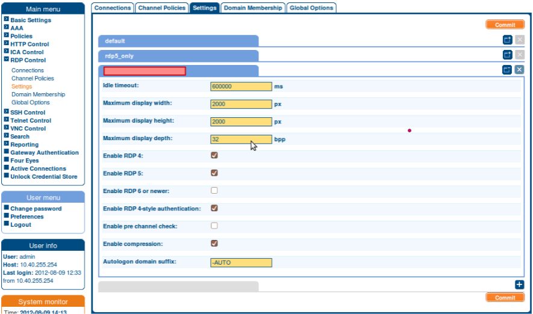

===========================================================================
 Remote Desktop Protocol by One Identity Safeguard for Privileged Sessions
===========================================================================

Remote Desktop Protocol, from here on RDP, is a network communications protocol that allows you to access another user’s desktop from your desktop. The other desktop could be far away, yet thanks to the RDP connection, you can still perform tasks on the remote device, such as modifying files, downloading applications, or diagnosing technical issues, as if you were physically present. 

In this scenario

- the device you are connecting **to** is the Remote Desktop server
- and your device, where you’re establishing the connection **from**, is the Remote Desktop client

One Identity’s Safeguard for Privileged Sessions solution, from now on SPS, allows you to set up the network connection between the Remote Desktop client and server. 

-----------------------------
 Setting up a new connection
-----------------------------

In the *Main menu*, go to **RDP Control > Settings**.

A tab will open where you can configure the details of your new connection.

 RDP connection settings

.. note::

 If you would like to configure further connections, e.g., to different desktops, you can click the |plus-sign| in the bottom-right corner.

 .. |plus-sign| image:: plus-sign.png
  :width: 17

.. note::

 You can collapse a connection configuration tab by clicking on the |minimize icon| in the top-right corner of the tab.

 .. |minimize icon| image:: minimize.png
  :width: 17

Connection settings
===================

1. Enter a name for the new connection in the field highlighted in red.

#. Provide the allowed idle timeout.

As the name suggests, this setting lets you determine the maximum idle time (in milliseconds) before the connection automatically disconnects.

3. Provide the maximum display width.
#. Provide the maximum display height as well.

The maximum display width and height determine the resolution of the remote desktop on your device, measured in pixels. Meaning, the remote desktop will appear at this size on your screen.

RDP versions
------------

There are several RDP versions you can choose from.

**RDP 4**: This RDP version comes with 32-bit color support, encryption, and allows the user of the client desktop to perform several tasks through the remote session: 

- local files can be used on the remote device,
- the local printer can be accessed through the remote session, and 
- the remote audio is redirected to the local machine.

**RDP 5**: Compared to the previous version, RDP 5 has an improved network bandwidth usage. 

**RDP 6 or newer**: RDP versions 6 and onward were improved for a smoother, steadier, and more secure experience. 

- Support for Transport Layer Security (TLS) was introduced on both ends, 
- Remote applications can be run on the client device,
- Network Level Authentication (NLA) was introduced to limit the use of remote resources before authentication and curb denial-of-service attacks.

**RDP 4-style authentication**: If you need backward compatibility for authentication, you can switch on this option to ensure successful authentication.

Further settings
----------------

- **Enable pre-channel** check When this option is selected, SPS will check for permissions before establishing a connection. If the necessary permissions are missing, it won’t follow through with the connection. 

- **Enable compression** You can enable compression to significantly reduce bandwidth usage.

Saving your configuration
-------------------------

You can save your connection configuration by clicking **Commit** in the bottom-right corner.

.. note::

 From now on, this confugation is available to apply to a future RDP connection.
